<div align="center">

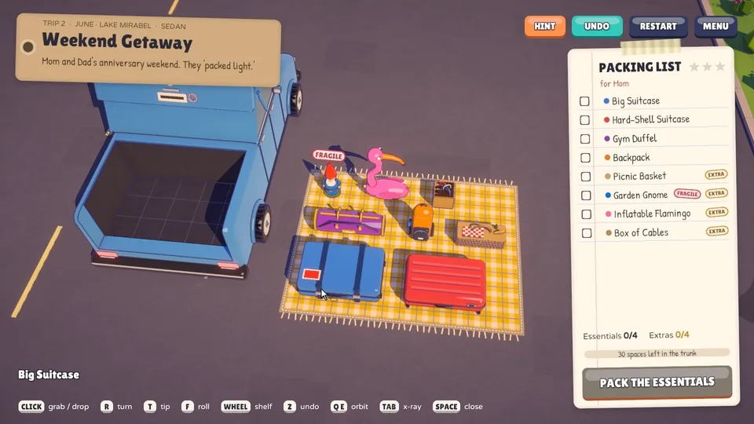

# Pack The Trunk

**Fit suitcases, groceries, camping gear, and ridiculous objects into increasingly awkward spaces.**

*A cozy voxel packing puzzle about one family, thirty years, and one very full trunk.*

[-222c37?logo=unity&logoColor=white)](https://unity.com/)
[](https://github.com/nearbycoder/PackTheTrunk/releases/latest)
[](https://www.blender.org/)
[](Assets/Scripts)
[](https://github.com/nearbycoder/PackTheTrunk/releases/latest)

**[Download for Linux](https://github.com/nearbycoder/PackTheTrunk/releases/latest)** ·
**[Watch the trailer](docs/media/pack-the-trunk-trailer.mp4)** ·
[Screenshots](#screenshots) ·
[Build from source](#build-from-source)

</div>

## Trailer

[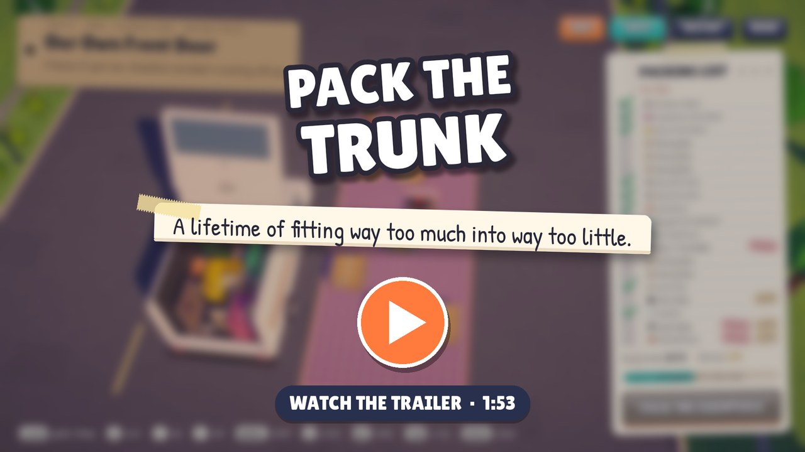](docs/media/pack-the-trunk-trailer.mp4)

<sub>Click the poster to open the 1080p MP4 (1:50, with sound). It's also attached to the
[v0.1.0 release](https://github.com/nearbycoder/PackTheTrunk/releases/tag/v0.1.0).</sub>

## About

Every family has one person who can make anything fit. In 1998 it's Grandpa Joe, a little red
wagon and a picnic at the creek, and his rule: ***big things first, fragile on top, and always
leave room for one more thing.*** After that, you're the family's packer.

Each trip parks a car in the driveway next to a picnic blanket piled with stuff. Pack every
**essential** into the trunk, then close it. Every **extra** you squeeze in raises your star
rating, and whatever doesn't fit gets left on the curb. The trunks get stranger (wheel wells,
sloped hatch glass, a pickup's toolbox, a clown who was already in the car), and so does the
cargo: a giant rubber duck, a taxidermy moose head, six hundred records, a tiered wedding cake,
and eventually the kitchen sink.

Between the puzzles, the family texts you. Over 33 trips and six chapters you pack for a
grandmother's big move, a dorm, a festival, a wedding, a first house and a nursery, until you're
back in Grandpa's wagon teaching your own daughter. Every trunk you close is photographed for
the family album.

## How to play

Pick something up off the blanket, turn it until it fits, and drop it into the trunk. A green
ghost shows where it will land; a red, striped one means it won't fit, and the game tells you
why. (Settings → Gameplay → Placement colours switches to blue / orange; the stripes stay either
way.)

| Input | Action |
| --- | --- |
| **Left click** | Pick up an item (from the driveway, the packing list, or back out of the trunk) / drop it in |
| **`R`** or **right click** | Turn it (hold **`Shift`** to turn the other way) |
| **`T`** | Tip it over, away from the camera |
| **`F`** | Roll it sideways |
| **Mouse wheel** / **`W`** **`S`** | Choose between resting heights (on top of something, or tucked into a gap underneath) |
| **`Esc`** or click off the trunk | Put the item back (`Esc` with empty hands pauses) |
| **`Z`** / **`Backspace`** | Undo |
| **RESTART** button | Unpack everything back onto the blanket (one undo puts it all back) |
| **`H`** or the **HINT** button | Ask Grandpa: an orange ghost shows where one thing goes |
| **`Space`** / **`Enter`** | Close the trunk once the essentials are packed (press twice if an extra would still fit) |
| **Right-drag**, **`Q`** **`E`** | Orbit the camera (the wheel zooms when your hands are empty) |
| **`Tab`** (hold) | X-ray: everything packed turns see-through, and you aim straight through it |
| **`M`** | Music on / off |
| **`Space`** / click during story texts | Hurry the texts along; `Space` / `Enter` then starts packing |
| **`Space`** / **`R`** / **`Esc`** on the postcard | Next trip / try again / trip map |

**Gamepad (new):** the left stick moves a cursor and **A** clicks, so every menu and button works
by pointing. While packing, **X** / **Y** / **RB** turn, tip and roll (hold **LB** to go the other
way), **D-pad up/down** picks a shelf, **D-pad left** asks Grandpa, holding the **left stick** in is X-ray, **D-pad right** closes the
trunk, **View** undoes, **B** puts back or backs out, **Menu** pauses (and moves on from story
texts and postcards), the **right stick** looks around and the **triggers** zoom. The key hints and
the tips switch to controller buttons as soon as you touch the pad, and back when you move the
mouse. It has only been tested with a simulated gamepad in the autopilot, not on a physical
controller or a Steam Deck yet. There's no touch support, and gamepad buttons can't be remapped.
If you try it on real hardware, [docs/GAMEPAD-TEST.md](docs/GAMEPAD-TEST.md) is a ten-minute
checklist. The game logs every controller it sees (`[Input]` lines in `Player.log`), and if
Unity only recognises a pad as a generic joystick, the game tells you and suggests Steam Input or
the pad's Xbox mode.

Every keyboard key above (except `Esc` and `Shift`) can be changed in **Settings → Controls**:
click a key and press the new one. A key that's already taken swaps with it, and **Defaults**
puts everything back. The key hints, the pause card and Grandpa's tips all show your keys. Key
hints run along the bottom of the screen while you pack.
**Seeing into the trunk.** While you hold something, anything packed that hides part of the
ghost (say, when you tuck a thing into a gap under a shelf) turns into a faint see-through
silhouette. Hold **`Tab`** (or click the left stick) to see through everything packed and aim at
any spot underneath or behind it.

Stuck? **Ask Grandpa** (`H`) shows where one thing goes, taken from a complete 100% packing of
the trip. Pick the hinted item up and it turns itself to match. If something already in the
trunk is somewhere that packing doesn't have it, he tells you to move it (or to undo). Hints are
only ever shown when you ask, and they never place anything for you. They never cost stars either,
but pack a trip to three stars **without** asking and Grandpa stamps his **seal** on the postcard.
The trip map and the album show which trips have one, so there's a reason to go back.

On your first trips, **Grandpa's tips** explain each move the first time it matters (picking up,
aiming, turning, fragile things, shelves, undo, the camera). Each one shows once; Settings →
Gameplay turns them off, and turning them back on shows them all again.

### The rules

- Items snap to a grid and can't overlap the car, wheel wells, sloped hatch glass, toolboxes, or
  the clown who was already in the car.
- Everything has to rest on something. Nothing floats.
- **Fragile** things (eggs, cakes, the garden gnome, the lava lamp…) can't have anything on top.
  They wear a red FRAGILE stamp while they wait on the blanket.
- Stars: ★ every essential packed, ★★ at least half the extras, ★★★ everything. The three stars
  beside PACKING LIST show what closing the trunk right now would earn, and the drop that earns
  a star tells you what the next one needs.

## Features

<table>
<tr>
<td width="50%">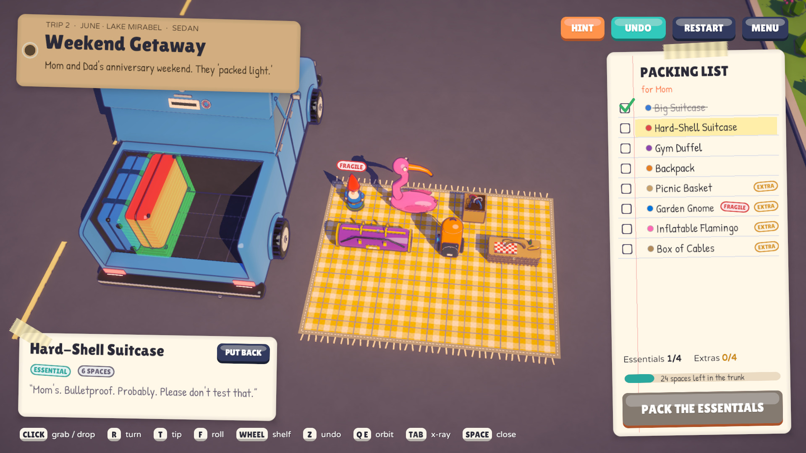</td>
<td width="50%">

**A tactile packing puzzle.** 116 objects modelled in Blender, each filling exactly the grid cells
it occupies, so what you see is what you pack. Turn, tip and roll anything with three keys that
follow the camera, choose between shelves and gaps, and orbit the trunk to find the space you
missed. Undo is unlimited, and anything can be lifted back out.

</td>
</tr>
<tr>
<td width="50%">

**Awkward spaces, fragile things.** Eleven rides, from a toy wagon and a Mini to a pickup, a
convertible, a minivan and a moving truck, each with its own trunk shape and obstacles. Fragile
cargo has to ride on top, so the order you pack in matters. Every level is proven solvable to
100% by an offline solver.

</td>
<td width="50%">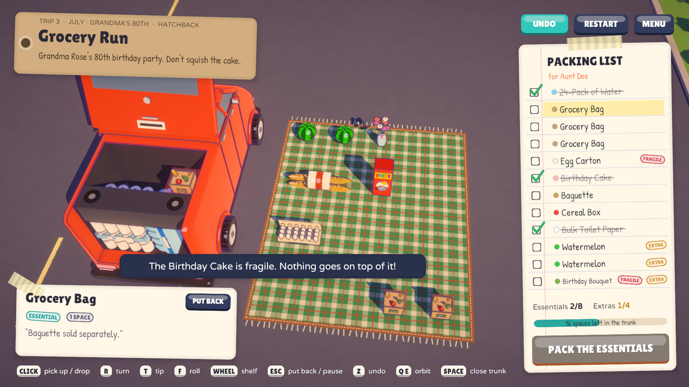</td>
</tr>
<tr>
<td width="50%">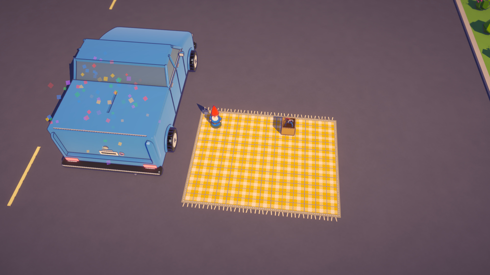</td>
<td width="50%">

**The slam.** Close the trunk and it slams, confetti pops, the horn honks, and the car pulls out
of the driveway. A postcard stamps your stars and lists what got left on the curb.

</td>
</tr>
<tr>
<td width="50%">

**A family story in 33 trips.** Texts from Mom, notes from Grandpa, chapter cards, and
heirlooms (Mr. Buttons the teddy, Grandpa's guitar, the grandfather clock, the gnome) that come
back trip after trip, scored with a lo-fi soundtrack.

</td>
<td width="50%">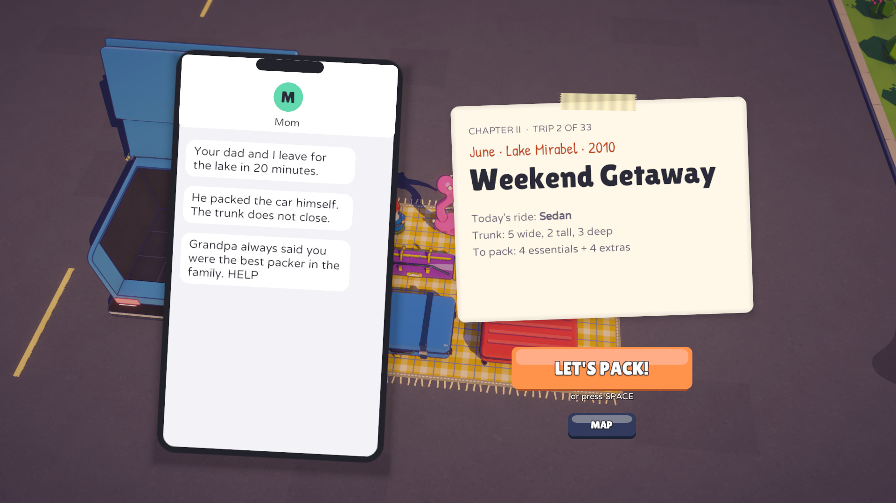</td>
</tr>
<tr>
<td width="50%">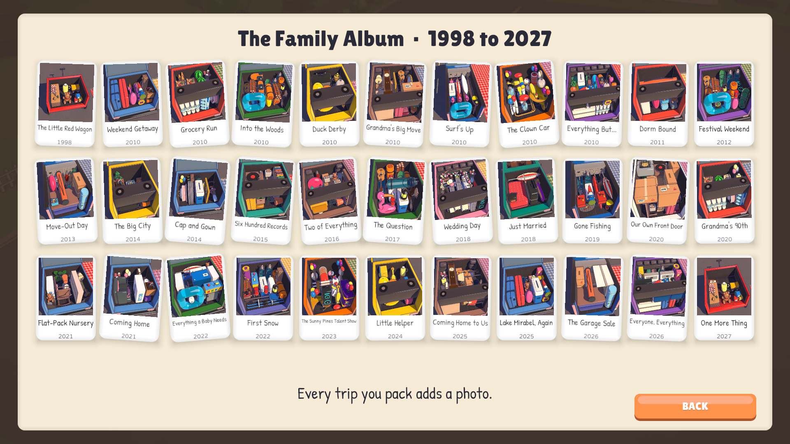</td>
<td width="50%">

**The family album.** The game photographs every trunk you close. The trip map is a scrapbook
paged by chapter, and the album fills with one polaroid per trip.

</td>
</tr>
</table>

Also in the box:

- **Menus and settings that feel finished.** A title screen with the next trip's car parked in
  the driveway, a pause menu that blurs the world behind it (and pauses by itself if the window
  loses focus), and a paper-wipe transition with a little car driving across. Settings are saved
  and applied live: volumes, window mode, resolution, V-Sync, frame cap, FOV, interface size,
  quality presets, render scale, anti-aliasing (up to MSAA 4x + SMAA), shadows, ambient
  occlusion, ink outlines, depth of field, bloom, camera speed, screen shake, key hints,
  Grandpa's tips, placement colours and story text speed. The HUD fits 16:9, 16:10, 4:3 and
  21:9 screens at every interface size from 80% to 120%. When a big trip's packing list wouldn't
  fit at a readable size, it scrolls (and follows whatever you're holding).
- **A sound design pass.** Landing sounds picked by material and size (soft bags, wood, metal,
  glass), spatial panning, music that crossfades between screens, muffles behind the story texts
  and ducks under the trunk slam, and a bus compressor and limiter so nothing clips.

## Content

| Chapter | Years | Trips |
| --- | --- | --- |
| I. Big Things First | 1998 | The Little Red Wagon |
| II. The Summer of Everything | 2010 | Weekend Getaway, Grocery Run, Into the Woods, Duck Derby, Grandma's Big Move, Surf's Up, The Clown Car, Everything But... |
| III. Leaving the Nest | 2011 to 2014 | Dorm Bound, Festival Weekend, Move-Out Day, The Big City, Cap and Gown |
| IV. Two of Us | 2015 to 2019 | Six Hundred Records, Two of Everything, The Question, Wedding Day, Just Married, Gone Fishing |
| V. Our Own Front Door | 2020 to 2023 | Our Own Front Door, Grandma's 90th, Flat-Pack Nursery, Coming Home, Everything a Baby Needs, First Snow, The Sunny Pines Talent Show |
| VI. One More Thing | 2024 to 2027 | Little Helper, Coming Home to Us, Lake Mirabel, Again, The Garage Sale, Everyone, Everything, One More Thing |

- **33 trips** across **6 chapters**, from a 3×1×2 toy wagon to a 6×4×5 minivan holding 25 things.
- **11 vehicles**: Little Red Wagon, Sedan, Hatchback, SUV, Mini, Station Wagon, Pickup Truck,
  Clown Car, Minivan, Convertible, Moving Truck.
- **116 items**, 29 of them fragile, from egg cartons and a bowling ball to a unicycle, a
  grandfather clock, a flat-pack crib, a disco ball and a second, folding clown.
- A finale, an ending and a credits roll. No spoilers here.

## Screenshots

| | |
| --- | --- |
| 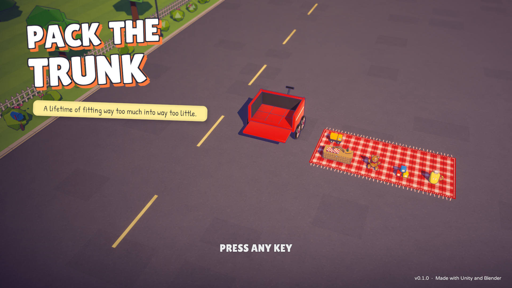 |  |
|  |  |
|  | 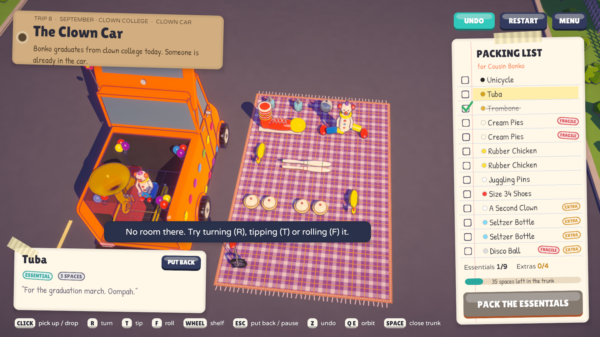 |
| 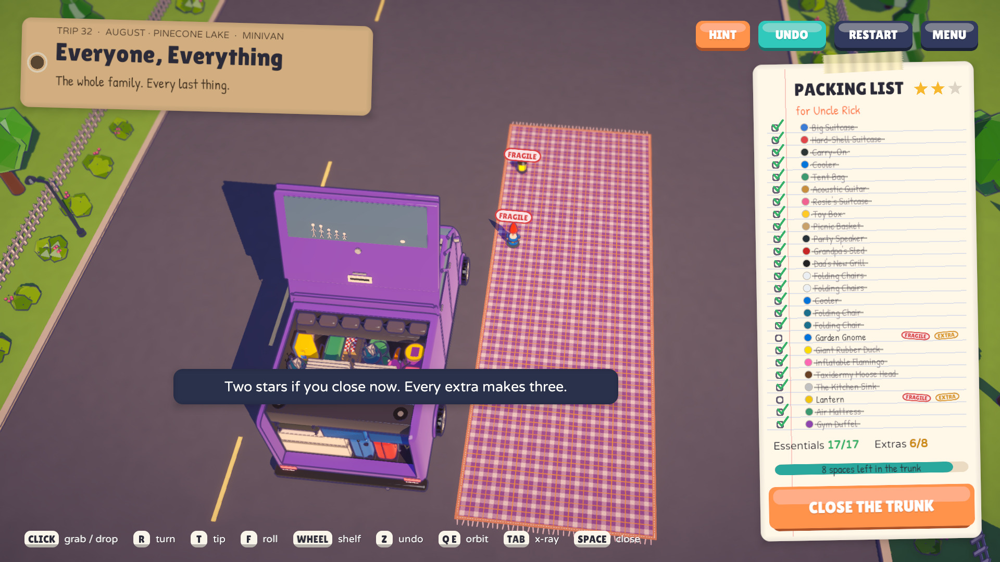 | 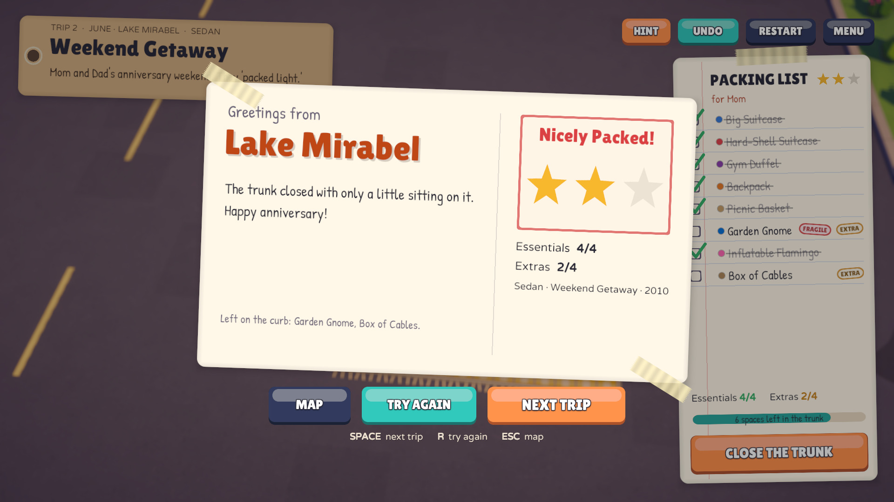 |
| 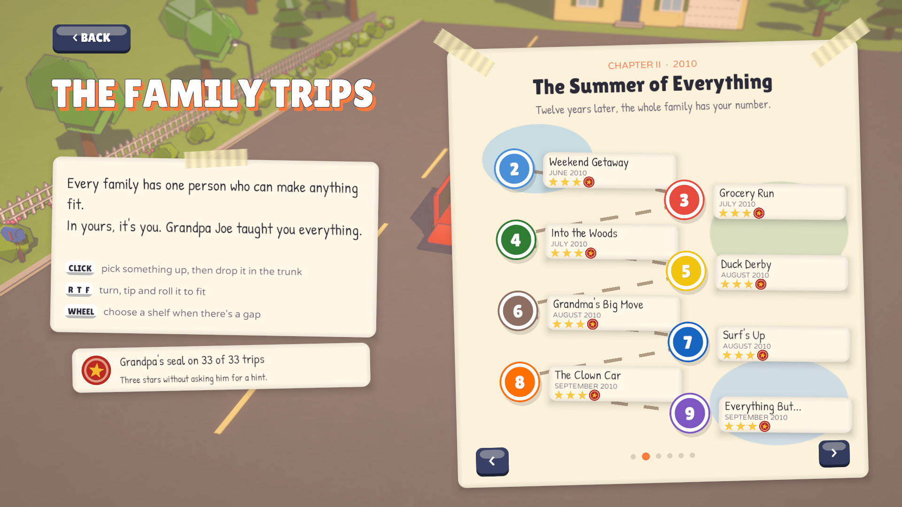 |  |
| 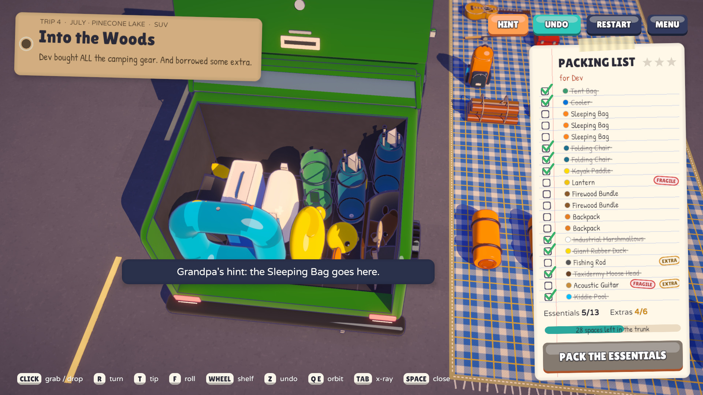 | 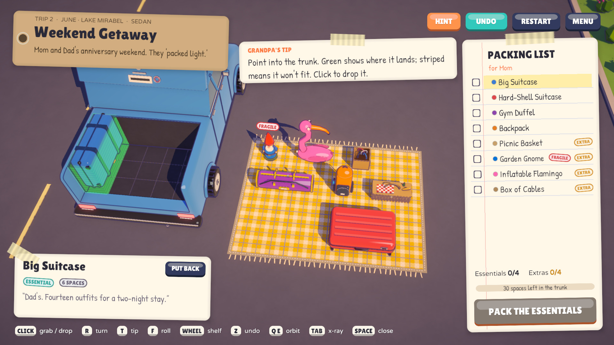 |
| 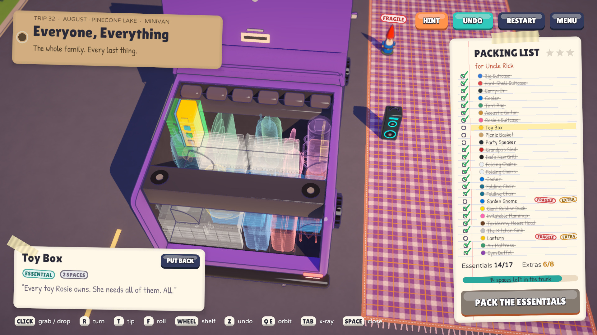 | |

## Play it

1. Download `PackTheTrunk-v0.1.0-linux-x86_64.zip` from the
   [latest release](https://github.com/nearbycoder/PackTheTrunk/releases/latest).
2. Unzip it and run `./PackTheTrunk.sh` (or `./PackTheTrunk.x86_64` directly). If your unzip tool
   drops the executable bits, `chmod +x PackTheTrunk.sh PackTheTrunk.x86_64` first.

It needs a 64-bit Linux desktop with OpenGL 4.5 or Vulkan. The launcher script uses Unity's native
Wayland backend when you're on Wayland, because the player hung at startup through XWayland on
the development machine. Progress, settings and album photos are saved under
`~/.config/unity3d/Nearby Games/Pack The Trunk/`.

## Build from source

**Requirements:** Unity **6000.6.2f1** (Unity 6.6) with Linux Build Support (plus Mac, Windows
or WebGL Build Support for those targets), Python 3 for the tools, ffmpeg for recordings and the trailer,
Blender **4.5** to regenerate models, and numpy + scipy to re-synthesize the stingers.

```sh
git clone https://github.com/nearbycoder/PackTheTrunk.git
cd PackTheTrunk
Tools/unity.sh               # open in the editor, then press Play
Tools/unity.sh build-linux   # batch build: Builds/Linux/PackTheTrunk.x86_64
Tools/unity.sh build-mac     # batch build: Builds/macOS/PackTheTrunk.app (universal, unsigned; not run on a Mac yet)
Tools/unity.sh build-windows # batch build: Builds/Windows (needs Windows Build Support; never built yet)
Tools/unity.sh build-webgl   # batch build: Builds/WebGL (not tested or published yet)
Tools/play.sh                # run the Linux build
```

`Tools/unity.sh` looks for the editor at `~/Unity/Hub/Editor/6000.6.2f1/Editor/Unity`; set
`UNITY=/path/to/Unity` to use another install. The **Pack The Trunk** menu in the editor has the
same build entry points (`Assets/Editor/BuildScript.cs`).

### Validators and tests

```sh
python3 Tools/solve_levels.py            # prove every level packs 100% under the game's rules
python3 Tools/solve_levels.py grandma    # print one level's solution (spoilers)
Tools/autopilot.sh                       # self-test: menus, settings, pause and all 33 trips, PASS/FAIL + screenshots
PTT_QUICK=1 Tools/autopilot.sh           # the same with three trips (about three minutes)
PTT_LAYOUT=1 PTT_SIZE=1200x900 Tools/autopilot.sh   # only the HUD layout check, at a 4:3 window
Tools/play.sh -pttBench                  # benchmark: holds each screen uncapped, logs [Perf] frame times
```

The autopilot (`Assets/Scripts/Gameplay/AutoPilot.cs`) only runs when the player is launched with
`-pttAutopilot`. It clicks, rotates, drops and undoes with real input events, packs all 33 trips
from the solver's solutions, closes every trunk, opens the ending and the album, and writes
screenshots to `Recordings/autopilot` (about 9 minutes). Like the recorders and the benchmark, it
plays on a sandboxed fresh save (`Assets/Scripts/Core/Prefs.cs`: settings and progress in memory,
photos in a cache folder), and `autopilot.sh` checks that your own save is byte-for-byte untouched.

### Regenerating assets

```sh
Tools/build_models.sh                    # every Blender model -> Assets/Resources/Models (items, vehicles, props)
Tools/build_models.sh items --only duck,tuba --preview /tmp/prev
python3 Tools/blender/contact_sheet.py /tmp/prev items   # labelled contact sheets for review
Tools/audio/build_sfx.sh                 # rebuild Assets/Resources/Audio from the CC0 packs + synthesized stingers
python3 Tools/solve_levels.py --dump Assets/Resources/PackTheTrunkSolutions.txt   # Grandpa's hints (after any level edit)
```

`build_sfx.sh` expects Kenney's Interface Sounds, Impact Sounds, RPG Audio and UI Audio packs
unzipped under `$KENNEY` (default `/tmp/kenney`) and Thimras' park ambiences under `$AMB`
(default `/tmp/amb`). The stingers are rendered by `Tools/audio/render_stingers.py`.

### Recordings, screenshots and the trailer

```sh
Tools/record.sh [name]          # gameplay video with captions -> Recordings/<name>.mp4
Tools/record_trailer.sh         # scripted trailer footage + clean stills -> Recordings/trailer-capture
Tools/make_trailer.py           # cut the trailer, poster, teaser and screenshots -> docs/media
PTT_STILLS_ONLY=1 Tools/record_trailer.sh Recordings/stills   # just the README stills (~3 min, no video)
Tools/package_release.sh 0.1.0  # zip the Linux build for a release -> Builds/PackTheTrunk-v0.1.0-linux-x86_64.zip
Tools/package_release.sh 0.1.0 mac  # zip the macOS app (with Gatekeeper instructions) -> ...-macos-universal.zip
```

Both recorders run the real game at a locked 30 fps (`Time.captureFramerate`) and capture its
audio in lockstep with `AudioRenderer`, so every take is identical and nothing stutters. They
start from a sandboxed fresh save and leave yours alone. The trailer script (`Showcase.Trailer.cs`) is split into sections, so one shot can be
re-taken without the rest: `PTT_TRAILER_ONLY=fragile,clown Tools/record_trailer.sh Recordings/retake`,
then pass both folders to `make_trailer.py` (later folders win). To refresh only the README
screenshots, capture stills-only and run `make_trailer.py <all capture folders> Recordings/stills --only stills`.
The trailer, poster and teaser are still the v0.1.0 cut, so they show the HUD without the
HINT button. `make_trailer.py` needs Pillow
(`pip install pillow`); the edit, the captions and the music bed are defined at the top of the script.

## Project structure

```
Assets/
  Resources/PackTheTrunkData.json   every item, level and chapter (shapes are ASCII layers)
  Resources/PackTheTrunkSolutions.txt  a 100% packing of every trip, for Grandpa's hints (generated)
  Resources/Models/                 Blender-generated FBX: 116 items, 33 vehicle bodies, props
  Resources/Music/, Audio/          soundtrack, sound effects and ambience (CREDITS.md in each)
  Resources/Fonts/                  Lilita One, Varela Round, Patrick Hand (OFL, licences alongside)
  Shaders/                          toon, ink outline, ghost, sky, FX sprite
  Scenes/Main.unity                 just the camera, sun and post-processing volume
  Scripts/Data/                     JSON loading, VoxelShape (rotations)
  Scripts/Gameplay/                 GameController, TrunkGrid (rules), PackItem, CameraRig,
                                    AutoPilot / Showcase / Bench (test, capture and benchmark modes)
  Scripts/Visuals/                  voxel mesher, procedural cars, model and material libraries, FX
  Scripts/UI/                       runtime-built uGUI: title, menus, settings, HUD, results, album
  Scripts/Audio/                    MusicDirector, Sfx, MasterBus (compressor + limiter)
  Scripts/Core/                     GameSettings (applied live), UiTime, OwnedAssets
  Editor/                           build entry points, import settings, project setup
Tools/
  solve_levels.py                   level solver / validator
  autopilot.sh, play.sh, unity.sh   self-test, run the build, editor launcher / batch builds
  record.sh, record_trailer.sh      gameplay video and trailer capture
  make_trailer.py                   trailer, poster, teaser and screenshots
  package_release.sh, release/      release zip and its launcher script
  blender/                          model generators (items.py, vehicles.py, props.py, ptt_lib.py)
  audio/                            build_sfx.sh, render_stingers.py
docs/media/                         trailer, poster, teaser and screenshots used by this README
```

## Tech highlights

- **Data-driven voxel shapes.** Items and levels live in one JSON file. An item's shape is a list
  of ASCII layers (`|` separates rows, each string is a slice from bottom to top, letters map to a
  palette), so adding an item or a level is a text edit. `VoxelShape` handles the 24
  orientations; `R`/`T`/`F` turn around axes snapped to the camera, so "tip it away from me"
  always means what you'd expect.
- **Rules in one place.** `TrunkGrid` answers every question the game asks: does it fit, what is
  it resting on, is anything fragile underneath or on top, and at which heights could it rest in
  this column (that list is what the mouse wheel and `W`/`S` cycle through). The error toasts come
  from the same checks, so the game can always say *why* something won't fit.
- **Proven-solvable levels.** `Tools/solve_levels.py` is a backtracking packer using the same
  rules. It proves every level packs 100%, and its solutions drive the autopilot, the gameplay
  recorder, the trailer and Grandpa's hints (shipped as `Resources/PackTheTrunkSolutions.txt`;
  `Solutions.cs` checks them against the level data at load, adds mirror images for symmetric
  trunks, and hides the HINT button for any trip that doesn't match).
- **Blender as a build step.** Every model is generated by Python in Blender
  (`Tools/blender/`): one builder per item, sized to the exact grid cells the item occupies, and
  one body per level wrapped around that level's trunk (with `Lid`, `Tailgate` and `Wheel_*`
  as separate objects so they animate). Materials are named by colour and swapped for shared URP
  materials on import. Items without a model fall back to coloured voxels.
- **Everything is built at runtime.** `GameController` bootstraps itself with
  `RuntimeInitializeOnLoadMethod`; cars, the driveway, the UI and even UI sprites are created in
  code, and runtime meshes, textures and materials are freed with their trip (`OwnedAssets`).
- **No hitch on the money shot.** The album photo is rendered when the trunk closes, read back
  from the GPU asynchronously and encoded to PNG on a worker thread. The packing loop allocates
  nothing per frame. On the development machine (Ryzen AI Max+ 395 / Radeon 8060S, 1600×900,
  High) every screen averages 2–3 ms uncapped, with no frames over 33 ms during play.
- **Audio that behaves.** `Sfx` pools 16 voices, pans by screen position, never repeats the same
  variation twice in a row and never steals a stinger. `MusicDirector` gives each trip its own
  track, crossfades, loops seamlessly and low-passes the music behind story texts. The mix runs
  through `MasterBus`: make-up gain, a 2:1 bus compressor and a −1.5 dBFS peak limiter.
- **Deterministic capture.** The showcase and trailer modes drive the real game with queued
  input events, lock the frame rate with `Time.captureFramerate`, and pull audio through
  `AudioRenderer` every frame, so video and sound stay in sync even while capture is paused
  between clips.

## Credits

Made by [nearbycoder](https://github.com/nearbycoder) (Nearby Games). All 3D models are generated
by the project's own Blender scripts, and the shaders, UI art (sprites are generated in code),
writing and stingers are original to this project.

| What | By | Licence |
| --- | --- | --- |
| Music: ["lofi Compilation"](https://opengameart.org/content/lofi-compilation) (9 tracks) | TAD | CC0 1.0 |
| Interface, impact, RPG and UI sound packs ([kenney.nl](https://kenney.nl/assets/category:Audio)) | Kenney | CC0 1.0 |
| [Park ambiences](https://opengameart.org/content/park-ambiences) (birds, wind loops) | Thimras | CC0 1.0 |
| Stingers, horn, engine, whooshes (`Tools/audio/render_stingers.py`) | Pack The Trunk | original |
| [Lilita One](https://fonts.google.com/specimen/Lilita+One) | Juan Montoreano | SIL OFL 1.1 |
| [Varela Round](https://fonts.google.com/specimen/Varela+Round) | Joe Prince / Varela Round Project Authors | SIL OFL 1.1 |
| [Patrick Hand](https://fonts.google.com/specimen/Patrick+Hand) | Patrick Wagesreiter | SIL OFL 1.1 |
| Unity 6 (URP, Input System, uGUI packages) | Unity Technologies | Unity licence terms (not redistributed here) |

Per-file details: [`Assets/Resources/Music/CREDITS.md`](Assets/Resources/Music/CREDITS.md),
[`Assets/Resources/Audio/CREDITS.md`](Assets/Resources/Audio/CREDITS.md), and the `OFL-*.txt`
licence next to each font in [`Assets/Resources/Fonts/`](Assets/Resources/Fonts).

**Tooling:** Unity 6.6 (URP), Blender 4.5, Python 3, ffmpeg and Pillow, developed with [Claude Code](https://claude.com/claude-code).

## Status and known issues

Version **0.1.0** plus three rounds of improvements since that release (see
[docs/IMPROVEMENTS.md](docs/IMPROVEMENTS.md)): all 33 trips, the story, the album, menus and
settings are complete, and the autopilot (194 checks) passes every trip. Still rough or missing:

- **Linux only (for now).** The release ships a Linux x86_64 build. A macOS build
  (`Tools/unity.sh build-mac`: a universal Apple Silicon + Intel `.app`, bundle id
  `com.nearbycoder.packthetrunk`) builds cleanly from Linux and packages with
  `package_release.sh <version> mac`. It is **not signed or notarized, hasn't been run on a Mac,
  and isn't published**. Windows (`build-windows`) needs Unity's Windows Build Support module,
  which isn't installed here, and WebGL hasn't been built or tested.
- **Gamepad support is new and untested on hardware.** It passes the autopilot's simulated-gamepad
  checks (pointing, every packing action, undo, hint, pause, menu clicks, handing back to the
  mouse), but no physical controller or Steam Deck has tried it yet. `docs/GAMEPAD-TEST.md` is the
  checklist for that first test, and `[Input]` lines in `Player.log` show what the player saw. No touch support; keyboard
  keys can be remapped, gamepad buttons can't.
- **Wayland/XWayland.** On the development machine (CachyOS, Wayland) the player hung at startup
  under XWayland, so the launchers force Unity's native Wayland backend. The player picks
  OpenGL Core by default; Vulkan works with `-force-vulkan`.
- **Editor on Arch-based distros.** The Unity editor needs `libxml2.so.2`; install
  `libxml2-legacy` (or point `LD_LIBRARY_PATH` at a copy, as `Tools/unity.sh` does).
- **Rare player crash on Wayland.** The player has segfaulted a couple of times mid-run (once while
  recording, once in the autopilot). The crash log from the autopilot one shows it on the main
  thread inside `wl_display_dispatch_queue_pending`, which is Unity's native Wayland backend handling
  compositor events, not game code. It hasn't been reproduced on demand. The recorders and
  `autopilot.sh` keep the log and retry once.
- **The trailer, poster and teaser are the v0.1.0 cut.** They don't show the HINT button, the star
  meter or Grandpa's seal. The README screenshots are from round 2, so they don't show the meter
  or the seal either (`docs/media/improvements/round3/` has round-3 shots).
- **The self-test needs a calm machine.** Under very heavy load (load average 40+ on 32 cores) the
  autopilot's queued input stopped registering and every input check failed. Re-run when it's
  quieter.
- No licence has been chosen for the project's own code and content yet. Third-party assets keep
  the licences listed above.
