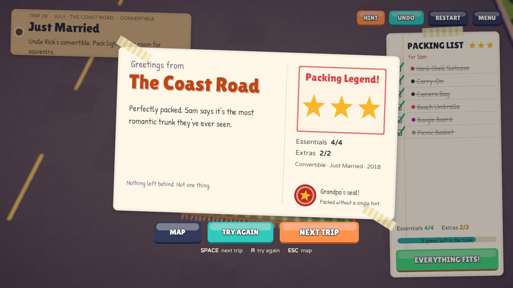
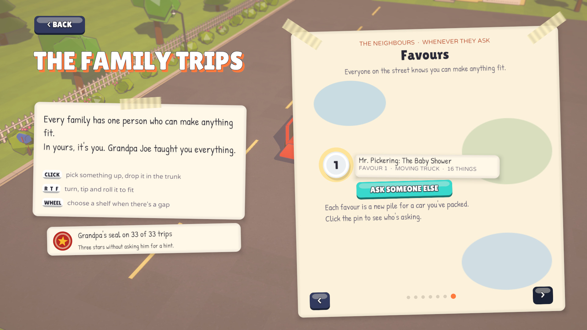
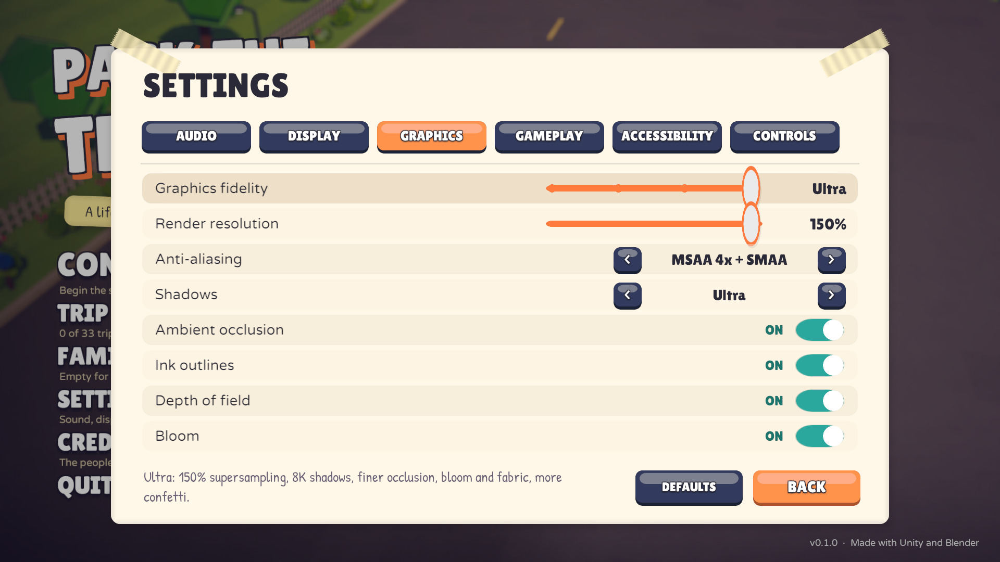

<div align="center">


# Pack The Trunk

**Fit suitcases, groceries, camping gear, and ridiculous objects into increasingly awkward spaces.**

*A cozy voxel packing puzzle about one family, thirty years, and one very full trunk.*

[-222c37?logo=unity&logoColor=white)](https://unity.com/)
[](https://github.com/nearbycoder/PackTheTrunk/releases/latest)
[](https://www.blender.org/)
[](Assets/Scripts)
[](https://github.com/nearbycoder/PackTheTrunk/releases/latest)

**[Download for Linux](https://github.com/nearbycoder/PackTheTrunk/releases/latest)** ·
**[Watch the trailer](docs/media/pack-the-trunk-trailer.mp4)** ·
[Screenshots](#screenshots) ·
[Build from source](#build-from-source)

</div>

> [!NOTE]
> **The download is older than this page.** The [v0.1.0 release](https://github.com/nearbycoder/PackTheTrunk/releases/tag/v0.1.0)
> is the launch build from October 4, 2026. The trailer, screenshots and features below show the game as it is in
> `main` today, after twelve rounds of improvements ([docs/IMPROVEMENTS.md](docs/IMPROVEMENTS.md)). Ask Grandpa's hints, X-ray,
> drag to pack, redo, the star meter and Grandpa's seal, gamepad and keyboard-only play, favours for the neighbours and the
> Graphics fidelity slider aren't in v0.1.0. Until a new release is cut, [build from source](#build-from-source) to play them.

## Trailer

[](docs/media/pack-the-trunk-trailer.mp4)

<sub>Click the poster to open the 1080p MP4 (1:53, with sound). All the footage is the game itself, recorded by its
own capture mode at the **Ultra** graphics step with its sound effects; the captions and title cards are added in the edit,
and the music is a track from the game's soundtrack. The v0.1.0 release still has the launch cut attached.</sub>

## About

Every family has one person who can make anything fit. In 1998 it's Grandpa Joe, a little red
wagon and a picnic at the creek, and his rule: ***big things first, fragile on top, and always
leave room for one more thing.*** After that, you're the family's packer.

Each trip parks a car in the driveway next to a picnic blanket piled with stuff. Pack every
**essential** into the trunk, then close it. Every **extra** you squeeze in raises your star
rating, and whatever doesn't fit gets left on the curb. The trunks get stranger (wheel wells,
sloped hatch glass, a pickup's toolbox, a clown who was already in the car), and so does the
cargo: a giant rubber duck, a taxidermy moose head, six hundred records, a tiered wedding cake,
and eventually the kitchen sink.

Between the puzzles, the family texts you. Over 33 trips and six chapters you pack for a
grandmother's big move, a dorm, a festival, a wedding, a first house and a nursery, until you're
back in Grandpa's wagon teaching your own daughter. Every trunk you close is photographed for
the family album. Once the story's second chapter is packed, the neighbours start asking for
favours too.

## Features

<table>
<tr>
<td width="50%"></td>
<td width="50%">

**A tactile packing puzzle.** 116 objects modelled in Blender, each filling exactly the grid cells
it occupies, so what you see is what you pack. Click to pick something up and click to drop it, or
drag it straight in. Turn, tip and roll it with three keys that follow the camera, choose between
shelves and gaps, and orbit the trunk to find the space you missed. Undo and redo are unlimited,
RESTART unpacks everything in one go (and one undo puts it back), and anything can be lifted back out.

</td>
</tr>
<tr>
<td width="50%">

**Stuck? Ask Grandpa.** HINT (or `H`) shows an orange ghost where one thing goes, taken from a
complete packing of the trip. Pick the hinted thing up and it turns itself to match; Grandpa never
places it for you. Hold `Tab` for **X-ray**: everything packed turns see-through and you can aim at
the gap behind it.

</td>
<td width="50%"></td>
</tr>
<tr>
<td width="50%"></td>
<td width="50%">

**Awkward spaces, fragile things.** Eleven rides, from a toy wagon and a Mini to a pickup, a
convertible, a minivan and a moving truck, each with its own trunk shape and obstacles. Fragile
cargo has to ride on top, so the order you pack in matters, and the game always says *why*
something won't fit. Every level is proven solvable to 100% by an offline solver.

</td>
</tr>
<tr>
<td width="50%">

**The slam, the stars and Grandpa's seal.** Close the trunk and it slams, confetti pops, the horn
honks and the car pulls out of the driveway. A postcard stamps your stars and lists what got left
on the curb. The three stars beside the packing list show what you'd earn right now. Pack a trip to
three stars without asking for a hint and Grandpa stamps his seal on the postcard.

</td>
<td width="50%"></td>
</tr>
<tr>
<td width="50%"></td>
<td width="50%">

**A family story in 33 trips.** Texts from Mom, notes from Grandpa, chapter cards, and
heirlooms (Mr. Buttons the teddy, Grandpa's guitar, the grandfather clock, the gnome) that come
back trip after trip, scored with a lo-fi soundtrack. On your first trips, Grandpa's tips explain
each move the first time it matters.

</td>
</tr>
<tr>
<td width="50%">

**The family album.** The game photographs every trunk you close. The trip map is a scrapbook
paged by chapter, and the album fills with one polaroid per trip. Click a polaroid to see the
photo up close (960×720, supersampled) with its stars and seal, and flip through the rest with
the arrow keys.

</td>
<td width="50%"></td>
</tr>
<tr>
<td width="50%"></td>
<td width="50%">

**Favours for the neighbours.** After chapter II, the trip map gets one more page. Each favour
borrows the car of a trip you've packed and brings a new pile, made only from things you've already
packed in the story. The game packs every pile into its trunk before you see it, so each one can be
packed completely, and Grandpa's hints work on it. Not in the mood for a 22-thing moving truck?
**ASK SOMEONE ELSE** swaps it for another neighbour, car and pile.

</td>
</tr>
</table>

**Your trunk waits for you.** Every change to the trunk is saved, so leaving a trip half-packed
(the trip map, the main menu, quitting, even a crash) costs nothing: start that trip again and
everything is back where it was, with the last 50 steps of undo and redo. The title's parked car
shows the waiting trunk, and coming back skips the texts you've already read. Starting a trip you've
closed before, the trip card says what's still to win: your best stars and what that run left on
the curb, or that the seal is still waiting.

## Graphics, settings and accessibility

Settings are saved and applied live, in six tabs:

- **Audio:** master, music, sound effects and ambience volumes, and muting when the window loses focus.
- **Display:** window mode, resolution, V-Sync, frame rate limit, field of view and interface size.
- **Graphics:** the **Graphics fidelity** slider, with fine-tune rows below it for render resolution,
  anti-aliasing, shadows, ambient occlusion, ink outlines, depth of field and bloom. Changing a row
  makes the slider read *Custom*, and picking a step again sets every row back.
- **Gameplay:** camera speed, invert camera tilt, key hints, Grandpa's tips and erasing progress.
- **Accessibility:** placement colours, X-ray (hold or toggle), screen shake, reduce motion and story text speed.
- **Controls:** remap every keyboard key and the gamepad's packing buttons.

**DEFAULTS** (on every tab) puts the settings and controls back, with Graphics fidelity on High; it leaves the
window mode and resolution alone.

**Graphics fidelity.** Four steps, from older laptops to supersampling. High is the default and the game's own
look. The GPU times are from the development machine's Radeon 8060S iGPU (Vulkan, 1600×900; title screen /
a half-packed minivan) and come from [round 12's measurements](docs/IMPROVEMENTS.md#round-12-results-2026-10-08).

| Step | What it sets | GPU time |
| --- | --- | --- |
| **Low** | 75% render resolution, FXAA, a 1024 shadow map with hard shadows, no ambient occlusion, bloom or depth of field, half the particles, and the street's detail reduced to a single grain | 0.43 / 0.47 ms |
| **Medium** | Full resolution, SMAA, a 2048 soft shadow map, bloom and depth of field, no ambient occlusion, ¾ of the particles, and the street's asphalt, lawn and curb detail (as on High) | 1.11 / 1.06 ms |
| **High** (default) | Full resolution, MSAA 4x + SMAA, a 4096 shadow map with high-quality soft shadows, 8-sample ambient occlusion, bloom, depth of field and all the particles | 2.00 / 1.87 ms |
| **Ultra** | 150% supersampling, an 8192 shadow map, 12-sample ambient occlusion, high-quality bloom, the picnic blanket woven at twice the texel density, 1.6× the dust and confetti, and finer street detail further out | 4.84 / 4.74 ms |

The first switch to a new step costs one 60–90 ms frame while its buffers are made; it happens in Settings, while
the slider moves.

**Accessibility.** *Placement colours* switches the green / red ghost to blue / orange (the red ghost's stripes
and the FRAGILE stamps stay either way). *Reduce motion* makes cards fade instead of sliding, stops anything
bobbing or pulsing, fades scene changes instead of wiping, and keeps the camera from sweeping or shaking. X-ray
can be held or toggled, screen shake can be turned off, and story texts come in at three speeds. Every input
method below can play the whole game.

**Readable on small screens.** Until you pick an interface size, it follows the screen: a Steam Deck–sized
1280×800 window starts at 110%. The self-test measures every text on every screen it visits at eight window
sizes from 800×600 to 2100×900 (including 1024×768, 1280×720 and 1280×800): each one comes out at 12 screen
pixels or more (Valve's recommended minimum), no word is broken across two lines, and text contrast against
what's actually behind it meets WCAG's 4.5:1 (3:1 for large or bold text). The HUD, the main menu and the trip map fit 16:9, 16:10, 4:3 and 21:9
screens at every interface size from 80% to 120%, and a big trip's packing list scrolls instead of shrinking.

## How to play

Pick something up off the blanket, turn it until it fits, and drop it into the trunk. A green
ghost shows where it will land; a red, striped one means it won't fit, and the game tells you
why.

- Items snap to a grid and can't overlap the car, wheel wells, sloped hatch glass, toolboxes, or
  the clown who was already in the car.
- Everything has to rest on something. Nothing floats.
- **Fragile** things (eggs, cakes, the garden gnome, the lava lamp…) can't have anything on top.
  They wear a red FRAGILE stamp while they wait on the blanket.
- Stars: ★ every essential packed, ★★ at least half the extras, ★★★ everything. The drop that
  earns a star tells you what the next one needs.
- Hints never cost stars, but a trip packed to three stars **without** one earns Grandpa's seal.
  The trip map and the album show which trips have it.

### Controls

**Mouse and keyboard**

| Input | Action |
| --- | --- |
| **Left click** | Pick up an item (from the driveway, the packing list, or back out of the trunk) / drop it in. Or press on it, drag, and let go over the trunk (anywhere else puts it back) |
| **`R`** or **right click** | Turn it (hold **`Shift`** to turn the other way) |
| **`T`** | Tip it over, away from the camera |
| **`F`** | Roll it sideways |
| **Mouse wheel** / **`W`** **`S`** | Choose between resting heights (on top of something, or tucked into a gap underneath) |
| **`Esc`** or click off the trunk | Put the item back (`Esc` with empty hands pauses) |
| **`Z`** / **`Backspace`** | Undo (hold **`Shift`** to redo, or click **REDO**) |
| **RESTART** button | Unpack everything back onto the blanket (one undo puts it all back) |
| **`H`** or the **HINT** button | Ask Grandpa: an orange ghost shows where one thing goes |
| **`Tab`** (hold) | X-ray: everything packed turns see-through, and you aim straight through it |
| **`Space`** / **`Enter`** | Close the trunk once the essentials are packed (press twice if an extra would still fit) |
| **Right-drag**, **`Q`** **`E`** | Orbit the camera (the wheel zooms when your hands are empty) |
| **`M`** | Music on / off |
| **`Space`** / click during story texts | Hurry the texts along; `Space` / `Enter` then starts packing |
| **`Space`** / **`R`** / **`Esc`** on the postcard | Next trip / try again / trip map |

Every keyboard key above (except `Esc` and `Shift`) can be changed in **Settings → Controls**:
click a key and press the new one. A key that's already taken swaps with it. The key hints along
the bottom of the screen, the pause card and Grandpa's tips all show your keys.

**Mouse only.** Right click turns what you're holding and the wheel picks a shelf. The key hints
along the bottom of the screen are buttons too: click **turn**, **tip** or **roll** (Shift + click
goes the other way), and **x-ray** to see through everything packed for as long as you hold that
item. While you click them, the thing in your hands stays over the spot you were aiming at. UNDO,
HINT, RESTART and CLOSE THE TRUNK are on-screen buttons, and REDO appears beside UNDO whenever there's
something to redo.

**Keyboard only.** In every menu the arrow keys move a cursor to the nearest button, switch,
slider, map pin or polaroid in that direction, ← / → change a setting, and **Enter** clicks. While
packing with empty hands, the arrows walk the packing list and the buttons, and Enter picks a thing
up (or lifts it back out of the trunk). Holding it, the arrows move it **one square at a time** across
the trunk, the usual keys turn, tip, roll and pick a shelf, and **Enter** drops it. The pause card's
HOW TO PACK list includes the ARROWS · ENTER row, so it's there even with the key hints off.

**Gamepad.** The left stick moves a cursor and **A** clicks, so every menu and button works by
pointing, and in menus the **D-pad** jumps to the next button in that direction (on a slider or
setting, left / right changes it). While packing:

| Button | Action |
| --- | --- |
| **X** / **Y** / **RB** | Turn / tip / roll (hold **LB** for the other way) |
| **D-pad up / down** | Pick a shelf |
| **D-pad left** | Ask Grandpa |
| **D-pad right** | Close the trunk |
| **Left stick click** | X-ray (hold, or click once with X-ray set to Toggle) |
| **View** | Undo (**LB** + **View** redoes) |
| **B** | Put back / back out |
| **Menu** | Pause (and move on from story texts and postcards) |
| **Right stick** / **triggers** | Look around / zoom |

The packing buttons can be moved in **Settings → Controls** (X, Y, RB, View, the D-pad, L3 and R3 can
take any packing action; A, B, Menu, LB, the sticks and the triggers keep their jobs). The key hints
and tips switch to controller buttons as soon as you touch the pad, and back when you move the mouse.
Gamepad support has only been tested with a simulated pad (see [Status](#status-and-known-issues)).

**Touch:** not supported.

## Content

| Chapter | Years | Trips |
| --- | --- | --- |
| I. Big Things First | 1998 | The Little Red Wagon |
| II. The Summer of Everything | 2010 | Weekend Getaway, Grocery Run, Into the Woods, Duck Derby, Grandma's Big Move, Surf's Up, The Clown Car, Everything But... |
| III. Leaving the Nest | 2011 to 2014 | Dorm Bound, Festival Weekend, Move-Out Day, The Big City, Cap and Gown |
| IV. Two of Us | 2015 to 2019 | Six Hundred Records, Two of Everything, The Question, Wedding Day, Just Married, Gone Fishing |
| V. Our Own Front Door | 2020 to 2023 | Our Own Front Door, Grandma's 90th, Flat-Pack Nursery, Coming Home, Everything a Baby Needs, First Snow, The Sunny Pines Talent Show |
| VI. One More Thing | 2024 to 2027 | Little Helper, Coming Home to Us, Lake Mirabel, Again, The Garage Sale, Everyone, Everything, One More Thing |

- **33 trips** across **6 chapters**, from a 3×1×2 toy wagon to a 6×4×5 minivan holding 25 things.
- **11 vehicles**: Little Red Wagon, Sedan, Hatchback, SUV, Mini, Station Wagon, Pickup Truck,
  Clown Car, Minivan, Convertible, Moving Truck.
- **116 items**, 29 of them fragile, from egg cartons and a bowling ball to a unicycle, a
  grandfather clock, a flat-pack crib, a disco ball and a second, folding clown.
- A finale, an ending and a credits roll. No spoilers here.
- After chapter II, **favours for the neighbours**: as many new piles as you like, for the cars you've
  packed. Favours earn stars but don't take album photos, earn seals or count towards the trips.

## Screenshots

All taken from the game at its Ultra graphics step.

| | |
| --- | --- |
|  |  |
|  |  |
|  |  |
|  |  |
|  |  |
|  |  |
|  |  |
|  |  |

## Play it

1. Download `PackTheTrunk-v0.1.0-linux-x86_64.zip` from the
   [latest release](https://github.com/nearbycoder/PackTheTrunk/releases/latest). That's the **launch build**
   (October 4, 2026), without the features added since. To play the game as this page shows it,
   [build from source](#build-from-source).
2. Unzip it and run `./PackTheTrunk.sh` (or `./PackTheTrunk.x86_64` directly). If your unzip tool
   drops the executable bits, `chmod +x PackTheTrunk.sh PackTheTrunk.x86_64` first.

Progress, settings and album photos are saved under `~/.config/unity3d/Nearby Games/Pack The Trunk/`.

### System requirements

- **OS:** 64-bit Linux (x86_64) with a desktop session. On Wayland, the launcher script uses Unity's
  native Wayland backend, because the player hung at startup through XWayland on the development machine.
  An X11 session hasn't been tried.
- **Graphics:** a GPU and driver that Unity 6 can run with OpenGL Core or Vulkan. The player uses OpenGL
  Core by default; add `-force-vulkan` for Vulkan.
- **Disk:** about 150 MB.
- **Input:** a mouse, a keyboard, or an Xbox-style gamepad that Unity recognises (no physical pad has been tried yet).
- **Tested on:** one machine only: CachyOS (KDE Plasma, Wayland), AMD Ryzen AI Max+ 395 with its Radeon
  8060S integrated GPU. Every Graphics fidelity step runs there with no frame over 33 ms at 1600×900. Low is
  meant for weaker GPUs, but nobody has tried one yet.
- macOS and Windows builds aren't published (see [Status](#status-and-known-issues)).

## Build from source

**Requirements:** Unity **6000.6.2f1** (Unity 6.6) with Linux Build Support (plus Mac, Windows
or WebGL Build Support for those targets), Python 3 for the tools, ffmpeg for recordings and the trailer,
Blender **4.5** to regenerate models, and numpy + scipy to re-synthesize the stingers.

```sh
git clone https://github.com/nearbycoder/PackTheTrunk.git
cd PackTheTrunk
Tools/unity.sh               # open in the editor, then press Play
Tools/unity.sh build-linux   # batch build: Builds/Linux/PackTheTrunk.x86_64
Tools/unity.sh build-mac     # batch build: Builds/macOS/PackTheTrunk.app (universal, unsigned; not run on a Mac yet)
Tools/unity.sh build-windows # batch build: Builds/Windows (needs Windows Build Support; never built yet)
Tools/unity.sh build-webgl   # batch build: Builds/WebGL (not tested or published yet)
Tools/play.sh                # run the Linux build
```

`Tools/unity.sh` looks for the editor at `~/Unity/Hub/Editor/6000.6.2f1/Editor/Unity`; set
`UNITY=/path/to/Unity` to use another install. The **Pack The Trunk** menu in the editor has the
same build entry points (`Assets/Editor/BuildScript.cs`).

### Validators and tests

```sh
python3 Tools/solve_levels.py            # prove every level packs 100% under the game's rules
python3 Tools/solve_levels.py grandma    # print one level's solution (spoilers)
Tools/autopilot.sh                       # self-test: menus, settings, pause and all 33 trips, PASS/FAIL + screenshots
PTT_QUICK=1 Tools/autopilot.sh           # the same with three trips (about eight minutes)
PTT_LAYOUT=1 PTT_SIZE=1280x800 Tools/autopilot.sh   # only the layout and text-size checks, at a Deck-sized window
Tools/resume_test.sh                     # crash test: half-pack a trip, SIGKILL the player, check a new one restores it (and its undo history)
Tools/play.sh -pttBench                  # benchmark: holds each screen uncapped, logs [Perf] frame times
Tools/play.sh -pttBench -pttFidelity "$PWD/Recordings/fidelity"   # each Graphics fidelity step: frame times + same-moment screenshots
python3 Tools/solve_levels.py --check-favours Recordings/autopilot/favours.json   # re-check the self-test's favours with the solver's rules
```

The autopilot (`Assets/Scripts/Gameplay/AutoPilot.cs`) only runs when the player is launched with
`-pttAutopilot`. It clicks, rotates, drops and undoes with real input events (mouse, keyboard and a
simulated gamepad), packs all 33 trips from the solver's solutions, closes every trunk, plays a few
favours and makes hundreds more (written to `favours.json` for `solve_levels.py --check-favours`), steps
the Graphics fidelity slider and reads each step back from the renderer, opens the ending and the album,
and writes screenshots to `Recordings/autopilot` (about 20 minutes). It also checks the HUD and menu layout
at three interface sizes and measures every visible text's size and contrast on each screen. Like the
recorders and the benchmark, it plays on a sandboxed fresh save (`Assets/Scripts/Core/Prefs.cs`: settings
and progress in memory, photos in a cache folder), and `autopilot.sh` checks that your own save is
byte-for-byte untouched. `resume_test.sh` keeps its sandbox in a file instead (`-pttPrefsFile`), so a
second player can pick up where the killed one left off; it makes the same check on your save.

Automated runs (the autopilot, the crash test, the benchmark and the recorders) don't open a window on
your desktop: when `kwin_wayland` is installed, `Tools/play.sh` starts the player inside a private,
headless KWin (`--virtual`) that still renders on the GPU, and it goes away with the player. That also
keeps the run out of the desktop compositor's way (a covered window there is throttled to ~11 fps).
`PTT_NESTED=0` shows a normal window instead, for watching a run.

### Regenerating assets

```sh
Tools/build_models.sh                    # every Blender model -> Assets/Resources/Models (items, vehicles, props)
Tools/build_models.sh items --only duck,tuba --preview /tmp/prev
python3 Tools/blender/contact_sheet.py /tmp/prev items   # labelled contact sheets for review
Tools/audio/build_sfx.sh                 # rebuild Assets/Resources/Audio from the CC0 packs + synthesized stingers
python3 Tools/solve_levels.py --dump Assets/Resources/PackTheTrunkSolutions.txt   # Grandpa's hints (after any level edit)
```

`build_sfx.sh` expects Kenney's Interface Sounds, Impact Sounds, RPG Audio and UI Audio packs
unzipped under `$KENNEY` (default `/tmp/kenney`) and Thimras' park ambiences under `$AMB`
(default `/tmp/amb`). The stingers are rendered by `Tools/audio/render_stingers.py`.

### Recordings, screenshots and the trailer

```sh
Tools/record.sh [name]          # gameplay video with captions -> Recordings/<name>.mp4
Tools/record_trailer.sh         # scripted trailer footage + clean stills -> Recordings/trailer-capture
Tools/make_trailer.py           # cut the trailer, poster, teaser and screenshots -> docs/media
PTT_STILLS_ONLY=1 Tools/record_trailer.sh Recordings/stills   # just the README stills (no video)
Tools/package_release.sh 0.1.0  # zip the Linux build for a release -> Builds/PackTheTrunk-v0.1.0-linux-x86_64.zip
Tools/package_release.sh 0.1.0 mac  # zip the macOS app (with Gatekeeper instructions) -> ...-macos-universal.zip
```

Both recorders run the real game at a locked 30 fps (`Time.captureFramerate`) and capture its
audio in lockstep with `AudioRenderer`, so every take is identical and nothing stutters. The
trailer script (`Showcase.Trailer.cs`) plays at the Ultra graphics step, which costs nothing
there because the capture waits for every frame. Both start from a sandboxed fresh save and leave
yours alone (`record_trailer.sh` hashes your save folder before and after to prove it). The trailer
script is split into sections, so one shot can be re-taken without the rest:
`PTT_TRAILER_ONLY=fragile,clown Tools/record_trailer.sh Recordings/retake`, then pass both folders
to `make_trailer.py` (later folders win). To refresh only the README screenshots, capture stills-only
and run `make_trailer.py <all capture folders> Recordings/stills --only stills`. `make_trailer.py`
needs Pillow (`pip install pillow`); the edit, the captions and the music bed are defined at the top
of the script.

## Project structure

```
Assets/
  Resources/PackTheTrunkData.json   every item, level and chapter (shapes are ASCII layers)
  Resources/PackTheTrunkSolutions.txt  a 100% packing of every trip, for Grandpa's hints (generated)
  Resources/Models/                 Blender-generated FBX: 116 items, 33 vehicle bodies, props
  Resources/Music/, Audio/          soundtrack, sound effects and ambience (CREDITS.md in each)
  Resources/Fonts/                  Lilita One, Varela Round, Patrick Hand (OFL, licences alongside)
  Shaders/                          toon (with the street's procedural asphalt, lawn and curbs), ink outline, ghost, sky, FX sprite
  Scenes/Main.unity                 just the camera, sun and post-processing volume
  Scripts/Data/                     JSON loading, VoxelShape (rotations)
  Scripts/Gameplay/                 GameController, TrunkGrid (rules), PackItem, CameraRig, Favours,
                                    AutoPilot / Showcase / Bench (test, capture and benchmark modes)
  Scripts/Visuals/                  voxel mesher, procedural cars, model and material libraries, FX
  Scripts/UI/                       runtime-built uGUI: title, menus, settings, HUD, results, album
  Scripts/Audio/                    MusicDirector, Sfx, MasterBus (compressor + limiter)
  Scripts/Core/                     GameSettings (applied live), Bindings, PadBindings, Prefs, UiTime, OwnedAssets
  Editor/                           build entry points, import settings, project setup
Tools/
  solve_levels.py                   level solver / validator
  autopilot.sh, play.sh, unity.sh   self-test, run the build, editor launcher / batch builds
  record.sh, record_trailer.sh      gameplay video and trailer capture
  make_trailer.py                   trailer, poster, teaser and screenshots
  package_release.sh, release/      release zip and its launcher script
  blender/                          model generators (items.py, vehicles.py, props.py, ptt_lib.py)
  audio/                            build_sfx.sh, render_stingers.py
docs/
  IMPROVEMENTS.md                   every improvement round's plan and measured results
  GAMEPAD-TEST.md                   a ten-minute checklist for a first real-controller test
  media/                            trailer, poster, teaser and screenshots used by this README
```

## Tech highlights

- **Data-driven voxel shapes.** Items and levels live in one JSON file. An item's shape is a list
  of ASCII layers (`|` separates rows, each string is a slice from bottom to top, letters map to a
  palette), so adding an item or a level is a text edit. `VoxelShape` handles the 24
  orientations; `R`/`T`/`F` turn around axes snapped to the camera, so "tip it away from me"
  always means what you'd expect.
- **Rules in one place.** `TrunkGrid` answers every question the game asks: does it fit, what is
  it resting on, is anything fragile underneath or on top, and at which heights could it rest in
  this column (that list is what the mouse wheel and `W`/`S` cycle through). The error toasts come
  from the same checks, so the game can always say *why* something won't fit.
- **Proven-solvable levels.** `Tools/solve_levels.py` is a backtracking packer using the same
  rules. It proves every level packs 100%, and its solutions drive the autopilot, the gameplay
  recorder, the trailer and Grandpa's hints (shipped as `Resources/PackTheTrunkSolutions.txt`;
  `Solutions.cs` checks them against the level data at load, adds mirror images for symmetric
  trunks, and hides the HINT button for any trip that doesn't match). Favours are made the same
  way in the game: each pile is packed into its trunk on a worker thread before it's offered.
- **Blender as a build step.** Every model is generated by Python in Blender
  (`Tools/blender/`): one builder per item, sized to the exact grid cells the item occupies, and
  one body per level wrapped around that level's trunk (with `Lid`, `Tailgate` and `Wheel_*`
  as separate objects so they animate). Materials are named by colour and swapped for shared URP
  materials on import. Items without a model fall back to coloured voxels.
- **A street without textures.** The driveway's asphalt (aggregate, resurfaced patches, a few sealed
  cracks), the mown lawn's stripes and the curbs' joints are drawn by the toon shader from world
  position, so they cost no texture memory or download size, fade their finest detail with distance so
  nothing shimmers, and drop to a single cheap grain on Low.
- **Everything is built at runtime.** `GameController` bootstraps itself with
  `RuntimeInitializeOnLoadMethod`; cars, the driveway, the UI and even UI sprites are created in
  code, and runtime meshes, textures and materials are freed with their trip (`OwnedAssets`).
- **No hitch on the money shot.** The album photo is rendered when the trunk closes, read back
  from the GPU asynchronously and encoded on a worker thread. The packing loop allocates nothing
  per frame.
- **Audio that behaves.** `Sfx` pools 16 voices, pans by screen position, picks landing sounds by
  material and size, never repeats the same variation twice in a row and never steals a stinger.
  `MusicDirector` gives each trip its own track, crossfades, loops seamlessly and low-passes the music
  behind story texts. The mix runs through `MasterBus`: make-up gain, a 2:1 bus compressor and a
  −1.5 dBFS peak limiter.
- **Deterministic capture.** The showcase and trailer modes drive the real game with queued
  input events, lock the frame rate with `Time.captureFramerate`, and pull audio through
  `AudioRenderer` every frame, so video and sound stay in sync even while capture is paused
  between clips.

## Credits

Made by [nearbycoder](https://github.com/nearbycoder) (Nearby Games). All 3D models are generated
by the project's own Blender scripts, and the shaders, UI art (sprites are generated in code),
writing and stingers are original to this project.

| What | By | Licence |
| --- | --- | --- |
| Music: ["lofi Compilation"](https://opengameart.org/content/lofi-compilation) (9 tracks) | TAD | CC0 1.0 |
| Interface, impact, RPG and UI sound packs ([kenney.nl](https://kenney.nl/assets/category:Audio)) | Kenney | CC0 1.0 |
| [Park ambiences](https://opengameart.org/content/park-ambiences) (birds, wind loops) | Thimras | CC0 1.0 |
| Stingers, horn, engine, whooshes (`Tools/audio/render_stingers.py`) | Pack The Trunk | original |
| [Lilita One](https://fonts.google.com/specimen/Lilita+One) | Juan Montoreano | SIL OFL 1.1 |
| [Varela Round](https://fonts.google.com/specimen/Varela+Round) | Joe Prince / Varela Round Project Authors | SIL OFL 1.1 |
| [Patrick Hand](https://fonts.google.com/specimen/Patrick+Hand) | Patrick Wagesreiter | SIL OFL 1.1 |
| Unity 6 (URP, Input System, uGUI packages) | Unity Technologies | Unity licence terms (not redistributed here) |

Per-file details: [`Assets/Resources/Music/CREDITS.md`](Assets/Resources/Music/CREDITS.md),
[`Assets/Resources/Audio/CREDITS.md`](Assets/Resources/Audio/CREDITS.md), and the `OFL-*.txt`
licence next to each font in [`Assets/Resources/Fonts/`](Assets/Resources/Fonts).

**Tooling:** Unity 6.6 (URP), Blender 4.5, Python 3, ffmpeg and Pillow, developed with [Claude Code](https://claude.com/claude-code).

## Status and known issues

`main` is version **0.1.0** plus twelve rounds of improvements ([docs/IMPROVEMENTS.md](docs/IMPROVEMENTS.md)):
all 33 trips, the story, the album, menus and settings are complete, favours for the neighbours keep going
after the story, the game can be played with a mouse alone, a keyboard alone or a gamepad, a Graphics fidelity
slider runs from Low to Ultra, and the full autopilot (394 checks in round 12) passes every trip.
Still rough or missing:

- **The release is behind `main`.** The only published build is v0.1.0 (October 4, 2026, Linux). It has
  none of the twelve rounds' features, and its attached trailer is the launch cut. A new release hasn't been cut.
- **Linux only (for now).** A macOS build (`Tools/unity.sh build-mac`: a universal Apple Silicon + Intel
  `.app`, bundle id `com.nearbycoder.packthetrunk`) builds cleanly from Linux and packages with
  `package_release.sh <version> mac`. It is **not signed or notarized, hasn't been run on a Mac,
  and isn't published**. Windows (`build-windows`) needs Unity's Windows Build Support module, which isn't
  installed here, and WebGL hasn't been built or tested.
- **Gamepad support is untested on hardware.** It passes the autopilot's simulated-gamepad checks
  (pointing, every packing action, undo, hint, pause, menu clicks, D-pad menu navigation, the album
  close-up, the fidelity slider, ASK SOMEONE ELSE, remapping a button, handing back to the mouse), but no
  physical controller or Steam Deck has tried it yet. [docs/GAMEPAD-TEST.md](docs/GAMEPAD-TEST.md) is the
  checklist for that first test, and `[Input]` lines in `Player.log` show what the player saw. If Unity only
  recognises a pad as a generic joystick, the game says so and suggests Steam Input or the pad's Xbox mode.
- **Keyboard-only play and favours are only machine-tested.** The self-test packs a whole trip with
  keyboard events only and re-checks hundreds of favours with the game's rules and the solver's, but nobody
  who relies on a keyboard has tried it, and nobody has played favours yet to say whether they're too easy,
  too hard or fun. Their words come from 16 neighbours, 26 errands and 8 sign-offs, so they repeat over a long run.
- **Graphics fidelity is measured on one machine.** Nobody has tried Low on a genuinely weak GPU or Ultra at
  4K, where its 150% render scale means a 5760×3240 render. Ultra's 8192 shadow map takes 128–256 MB of video
  memory; on a GPU with little memory, set the Shadows row to High.
- **Small screens are checked, not seen.** Text size, wrapping and contrast are measured at eight window
  sizes from 800×600 to 2100×900, but nobody has looked at the game on a real Deck, and live re-layout while a
  window is being resized is untested.
- **Wayland/XWayland.** On the development machine the player hung at startup under XWayland, so the
  launchers force Unity's native Wayland backend. The player has segfaulted a couple of times mid-run inside
  that backend (`wl_display_dispatch_queue_pending`, not game code); it hasn't been reproduced on demand. A crash
  doesn't cost the trunk you were packing: it's saved after every change.
- **Editor on Arch-based distros.** The Unity editor needs `libxml2.so.2`; install
  `libxml2-legacy` (or point `LD_LIBRARY_PATH` at a copy, as `Tools/unity.sh` does).
- **The self-test needs a calm machine.** Under very heavy load (load average 40+ on 32 cores) the
  autopilot's queued input stopped registering and every input check failed. Re-run when it's quieter.
- No licence has been chosen for the project's own code and content yet. Third-party assets keep
  the licences listed above.
